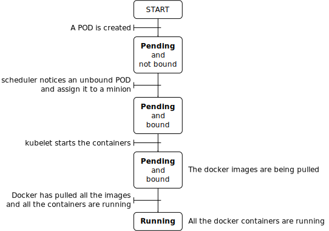
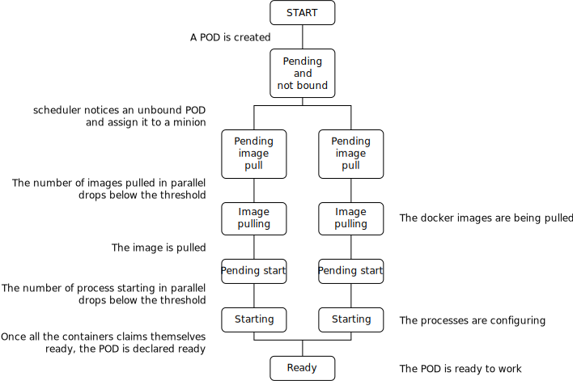

# Throttling study

## Current start-up flow

The current flow when a POD is started by kubernetes is composed of the following steps:

1. `scheduler` binds the POD to a minion. This leaves the state of the POD in `Pending` status.
2. `kubelet` pulls the images of the PODs. This leaves the state of the POD in `Pending` status.
3. When a docker images is pulled, the container is started immediately.
4. Once all the containers are running, `kubelet` passes the status of the POD to `Running`.

## Running does not imply Ready

The first remark is that it is not because a process is started that it is ready to work and process traffic.

For example, we can have a process that starts its life by fetching some configuration elements from somewhere and doing some expensive configuration stuff before being really ready to work.

This proposition aims at distinguishing the `starting` and `ready` state.

## Need for throttling

### Throttling the starting containers

The initialization of the containers might be so CPU expensive that it would be unwise to have too many containers in `starting` state at the same time.

We want to limit the number of containers `starting` at the same time.

If the issue is about CPU, the limit should be per machine.

### Throttling the images pull

If too many machines are pulling too many images from the registry at the same time, it may hurt the docker registry.

In order to keep it reasonably loaded, we want to limit the number of images that can be pulled at the same time.

If the issue is about a bottleneck on the central registry side, the limit should be global.

## Proposed flow

In order to implement the above-mentioned gaps, we propose the following new flow:

When a POD is bound to a machine, kubelet does not start the pull of all the images immediately.
There is a gate keeper that limits the number of images that can be fetched simultaneously

Once an image for a container has been fetched, the container can be created but not started immediately. A second gate keeper limits the number of processes that can be in the `starting` status.

In order to be able to limit the number of containers that are in the `starting` status at one time, we need to know when a process leaves the `starting` status. From a docker perspective, there is no clean generic way to know that a process is `ready` without any collaboration from that process.

Systemd had a similar need to know when a service is ready in order to know when it can start the follow-up units.

The services which are `Type=notify` require the service to tell systemd about their state by posting the info on a UNIX socket.

Could we implement a similar mechanism?

## Questions:

Do we want to limit the number of images being pulled a given time?
* by machine?
* globally?

Do we want to limit the number of process starting at a given time?
* by machine?
* globally?

How do we consider that a container progressed from the `starting` state to the `ready` one?
* by having that process notify kubernetes?
